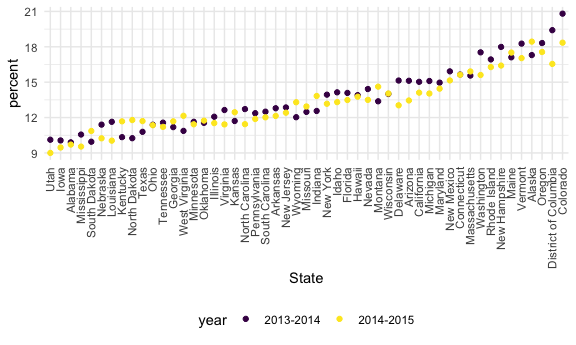

Data wrangling 2
================

## strings and vectors

``` r
string_vec = c("my", "name", "is", "jeff")

str_detect(string_vec, "m")
```

    ## [1]  TRUE  TRUE FALSE FALSE

``` r
str_detect(string_vec, "jeff")
```

    ## [1] FALSE FALSE FALSE  TRUE

``` r
str_detect(string_vec, "Jeff")
```

    ## [1] FALSE FALSE FALSE FALSE

``` r
str_replace(string_vec, "jeff", "Jeff")
```

    ## [1] "my"   "name" "is"   "Jeff"

``` r
str_replace(string_vec, "e", "This is an uppercase E")
```

    ## [1] "my"                        "namThis is an uppercase E"
    ## [3] "is"                        "jThis is an uppercase Eff"

``` r
str_replace(string_vec, "jeff", "") 
```

    ## [1] "my"   "name" "is"   ""

^ represents beginning of the line - finding “i think” at the beginning
of the line $ represents end of the line

``` r
string_vec = c(
  "i think we all rule for participating",
  "i think i have been caught",
  "i think this will be quite fun actually",
  "it will be fun, i think"
  )

str_detect(string_vec, "i think")
```

    ## [1] TRUE TRUE TRUE TRUE

``` r
str_detect(string_vec, "^i think")
```

    ## [1]  TRUE  TRUE  TRUE FALSE

``` r
str_detect(string_vec, "i think$")
```

    ## [1] FALSE FALSE FALSE  TRUE

\[\]to inlcude uppercase and lowercase (enter both into brackets)

``` r
string_vec = c(
  "Y'all remember Pres. HW Bush?",
  "I saw a green bush",
  "BBQ and Bushwalking at Molonglo Gorge",
  "BUSH -- LIVE IN CONCERT!!"
  )

str_detect(string_vec, "Bush")
```

    ## [1]  TRUE FALSE  TRUE FALSE

``` r
str_detect(string_vec, "[Bb]ush")
```

    ## [1]  TRUE  TRUE  TRUE FALSE

specify a range

``` r
string_vec = c(
  '7th inning stretch',
  '1st half soon to begin. Texas won the toss.',
  'she is 5 feet 4 inches tall',
  '3AM - cant sleep :('
  )

str_detect(string_vec, "[0-9][a-zA-Z]")
```

    ## [1]  TRUE  TRUE FALSE  TRUE

“.” to represent anything

``` r
string_vec = c(
  'Its 7:11 in the evening',
  'want to go to 7-11?',
  'my flight is AA711',
  'NetBios: scanning ip 203.167.114.66'
  )

str_detect(string_vec, "7.11")
```

    ## [1]  TRUE  TRUE FALSE  TRUE

``` r
str_detect(string_vec, "711")
```

    ## [1] FALSE FALSE  TRUE FALSE

``` r
str_detect(string_vec, "7.")
```

    ## [1] TRUE TRUE TRUE TRUE

specify for "\[ or "

``` r
string_vec = c(
  'The CI is [2, 5]',
  ':-]',
  ':-[',
  'I found the answer on pages [6-7]'
  )

str_detect(string_vec, "\\[")
```

    ## [1]  TRUE FALSE  TRUE  TRUE

## Why factors are weird

-   without specifcying, factor will level in numeric order

-   convert back to numeric, male will be “2” and female “1”

-   fct\_relevel: reorder, just state one = that will be moved up to the
    beginning

``` r
factor_vec = factor(c("male", "male", "female", "female"))

as.numeric(factor_vec)
```

    ## [1] 2 2 1 1

``` r
factor_vec = fct_relevel(factor_vec, "male")
as.numeric(factor_vec)
```

    ## [1] 1 1 2 2

## NSQH

-   downlaod url

-   select first table only and remove first row

-   convert values to numeric (converted to character because of
    presence of “a”)

``` r
nsduh_url = "http://samhda.s3-us-gov-west-1.amazonaws.com/s3fs-public/field-uploads/2k15StateFiles/NSDUHsaeShortTermCHG2015.htm"

table_marj = 
  read_html(nsduh_url) %>% 
  html_table() %>% 
  first() %>% 
  slice(-1)
```

Let’s clean this up

-   removing P value column

-   pivot longer

-   separating age and year (telling to separate on “(”)

-   removing all parenthesis

-   removing letters at end of percent

``` r
marj_df = 
  table_marj %>% 
  select(-contains("P value")) %>% 
  pivot_longer(
    -State,
    names_to = "age_year",
    values_to = "percent"
    ) %>% 
  separate(age_year, into = c("age", "year"), "\\(") %>% mutate(
    year = str_replace(year, "\\)", ""), 
    percent = str_replace(percent, "[a-c]$", ""),
    percent = as.numeric(percent)
  ) %>% 
filter(!(State %in% c("Total U.S.", "Northeast", "Midwest", "South", "West")))
```

Do dataframe stuff

-   states are in alphabetical order because factored in alphabetical
    order
    -   change in mutate to ordered in percent order

``` r
marj_df %>% 
  filter(age == "12-17") %>% 
  mutate(
    State = fct_reorder(State, percent)
  ) %>% 
  ggplot(aes(x = State, y = percent, color = year)) + 
  geom_point() +
  theme(axis.text.x = element_text(angle = 90, vjust = 0.5, hjust = 1))
```


